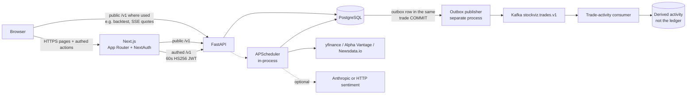

# StockViz

Full-stack market analytics, strategy backtesting, and paper trading for equities and options.

StockViz is a Next.js + FastAPI + PostgreSQL platform: it ingests **end-of-day** prices and news, computes technical indicators, scores daily recommendations, and runs a paper-trading ledger with FX-aware **equity** fills, pending orders, dividends, and long options priced by Black-Scholes. Background jobs run in-process via APScheduler. Auth is NextAuth on the web app, with a short-lived server-to-server JWT on authenticated `/v1` calls.

**Docs:** [Setup](./docs/SETUP.md) · [Deployment](./docs/DEPLOYMENT.md) · [Known limitations](./docs/KNOWN_LIMITATIONS.md) · [Sentiment](./docs/SENTIMENT.md) · [Project history](./REWRITE_PLAN.md)

This repository does **not** currently provide a verified public demo. Clone and run locally (see [Setup](./docs/SETUP.md)).

## Highlights

- Look-ahead-safe strategy backtesting over stored daily bars, with configurable commission/slippage and a buy-and-hold benchmark.
- Black-Scholes options pricing with Greeks; volatility is 30-day historical vol, not an implied-vol surface.
- FX-aware **equity** paper trading (USD cash, native-currency fills, realized P&L on sells, dividends, pending limit/stop/take-profit orders that reserve buying power and shares). Long options are a separate long-only book: premiums debit USD cash and are **not** a complete multi-currency options ledger.
- PostgreSQL-backed market data, portfolio snapshots, orders, dividends, alerts, comments, and recommendations.
- Short-lived HS256 JWT auth boundary: the Next.js server mints a 60-second token; the browser never sees it.
- Scheduled ingest and settlement (prices, FX, news, metrics, sentiment, recommendations, snapshots, pending orders, dividends, option expiry, alerts).
- Quality gates spanning Python and TypeScript tests, Alembic migration checks, OpenAPI→client type sync, dependency audits, an API Docker build, and Playwright e2e.

## Market data (what “live” means here)

Provider ingest is **daily OHLCV**, cached in Postgres (yfinance primary, Alpha Vantage fallback when `ALPHA_VANTAGE_KEY` is set; Newsdata.io for headlines, which requires `NEWSDATA_KEY`). Fills, charts, backtests, and alerts all price off the latest `1d` close — not an exchange real-time feed.

The ticker-page quote badge is a **simulated quote**: an SSE Gaussian random walk starting from that cached close (`GET /v1/stream/quotes/{ticker}`). It is labeled in the UI. Headline sentiment scoring is off unless `ANTHROPIC_API_KEY` or `SENTIMENT_PROVIDER=http` is configured.

## What it does

- **Markets** — sortable table of tracked symbols with inline sparklines.
- **Ticker detail** — OHLCV candlesticks (lightweight-charts), SMA/EMA/RSI/MACD, related news, comments, and the simulated quote badge.
- **Compare** — normalized price chart for multiple tickers.
- **News** — paginated company-news feed from Newsdata.io, cached in Postgres.
- **Recommendations** — daily-scored buy candidates (six price/volume votes plus an optional news-sentiment vote).
- **Screener / backtest / leaderboard** — filter the universe, replay a historical strategy, rank public portfolios by NAV.
- **Paper trading** — per-user portfolio with cash, equity and long-only option positions, pending orders, trade history, P&L, dividends, and FX conversion to USD.
- **Watchlist and in-app price alerts** — alerts evaluate hourly on weekdays; there is no email/push.
- **Auth** — email/password (bcrypt) plus optional Google OAuth (needs `GOOGLE_CLIENT_*`).

## Architecture

Synchronous request path vs scheduled work:



Kafka is **not** in the trade commit path. Cash and positions commit in PostgreSQL with an outbox row; a worker publishes later. `/health` does not depend on the broker. See [`docs/EVENT_DRIVEN_ARCHITECTURE.md`](./docs/EVENT_DRIVEN_ARCHITECTURE.md).

- **Request path.** The browser talks to Next.js for pages and authenticated mutations. Some public FastAPI endpoints are also called from the browser via `NEXT_PUBLIC_API_URL` (for example the client-side backtest form posts to `/v1/backtest`, and the ticker badge opens SSE at `/v1/stream/quotes/{ticker}`). Authed paper-trading calls are minted on the Next.js server as `Authorization: Bearer <jwt>` (`{ sub: "<user.id>" }`, 60 s, signed with `INTERNAL_API_TOKEN`) — the browser never sees that JWT. FastAPI verifies it in `auth.py::require_user_id`.
- **Scheduled work.** With `ENABLE_SCHEDULER=true`, APScheduler runs inside the API process (weekday NY-time jobs for prices, FX, metrics, sentiment, recommendations, snapshots, pending-order settlement, dividends, option expiry, news, hourly top-movers + alert evaluation). Jobs take a Postgres advisory lock so two instances cannot double-fill.
- **Third-party ingest.** Daily OHLCV uses yfinance first (no API key). Alpha Vantage is a fallback when `ALPHA_VANTAGE_KEY` is set and yfinance returns nothing. News ingest requires `NEWSDATA_KEY` and skips when it is blank. Unset keys make the matching *keyed* job log and skip; price ingest still runs through yfinance. The rest of the app still runs on cached/seeded data.
- **Hosting intent.** Vercel for `apps/web`, Render for `apps/api` + Postgres. See [Deployment](./docs/DEPLOYMENT.md) for what is in source control vs dashboard-owned.

Sentry collects errors from both apps when a DSN is set.

## Stack

| Layer      | Choice                                                        |
| ---------- | ------------------------------------------------------------- |
| Web        | Next.js 16 (App Router), React 19, TS, Tailwind v4, shadcn/ui |
| Auth       | NextAuth v5 (credentials + optional Google OAuth, bcrypt)     |
| Charts     | lightweight-charts (TradingView)                              |
| API        | FastAPI, SQLModel, Alembic, APScheduler                       |
| DB         | Postgres 16                                                   |
| Ingestion  | yfinance (primary) + Alpha Vantage (fallback) + Newsdata.io   |
| Hosting    | Vercel (web) + Render (api + db)                              |
| Monitoring | Sentry                                                        |
| Tooling    | pnpm + uv, biome + ruff, pyright + tsc                        |

## Repo layout

```
apps/
  web/                 Next.js frontend
    app/               App Router routes (markets, stocks, screener, backtest, …)
    components/        shadcn/ui + custom (chart, trade form, etc.)
    lib/               server-only API client, auth helpers
    tests/             Vitest unit tests + Playwright e2e
    auth.ts            NextAuth v5 setup
    sentry.*.config.ts Sentry init for each runtime
  api/                 FastAPI backend
    src/stockviz/
      routers/         /v1 endpoints (symbols, bars, trades, options, …)
      services/        ingest, recommend, indicators, trading, sentiment
      models/          SQLModel tables
      scheduler.py     APScheduler jobs
    migrations/        Alembic
    tests/             pytest
    seed-data/         companies.json + price CSVs for backfill
    Dockerfile         Production image (uv + uvicorn)
infra/
  docker-compose.yml   Local Postgres + Adminer
  render.yaml          Render Blueprint (api + db)
.github/workflows/     CI: lint, typecheck, tests, audit, Docker, e2e
docs/                  Setup, deployment, known limitations, sentiment
REWRITE_PLAN.md        Historical v1 → v2 rewrite plan
```

## Local dev

Full step-by-step instructions for **macOS / Linux** and **Windows** are in [`docs/SETUP.md`](./docs/SETUP.md). The short version:

```bash
pnpm install
uv --directory apps/api sync
cp apps/web/.env.example apps/web/.env.local        # Windows: Copy-Item
cp apps/api/.env.example apps/api/.env              # Windows: Copy-Item
pnpm db:up                                          # Postgres on :5434, Adminer on :8080
uv --directory apps/api run alembic upgrade head
uv --directory apps/api run python -m stockviz.cli seed
uv --directory apps/api run python -m stockviz.cli backfill
pnpm api:dev      # terminal 1 — FastAPI on :8000
pnpm dev:web      # terminal 2 — Next.js on :3000 (auto-bumps to next free port)
```

`seed` without `backfill` leaves the markets table empty (symbols, no bars).
Google sign-in needs `GOOGLE_CLIENT_ID` / `GOOGLE_CLIENT_SECRET`; email
signup works without them.

## Quality gates

```bash
pnpm lint                                  # biome (web) + ruff (api)
pnpm typecheck                             # tsc + pyright
pnpm --filter @stockviz/web test           # Vitest
uv --directory apps/api run pytest
pnpm build                                 # production build of the web app
```

GitHub Actions runs the above plus `pnpm audit` / `pip-audit`, an API Docker
build, `alembic check`, OpenAPI client-type sync, and Playwright e2e on every
push and PR to **`dev`** and **`main`**.

Work off **`dev`**. Open feature PRs into `dev`, not `main`. `main` is the
release branch. The `migration` and `v2` branches are retired remnants of
the rewrite.

## Deployment

Walkthrough (Vercel for web, Render Blueprint for api + db, env vars,
first-time seeding, rollback) is in [`docs/DEPLOYMENT.md`](./docs/DEPLOYMENT.md).

Source control records **intended** hosts and Blueprint defaults. It does
**not** record whether a Vercel or Render dashboard currently deploys on
push. `infra/render.yaml` sets `autoDeploy: true` (Render’s Blueprint
default). This repository does not enable, disable, or trigger production
rollouts.

- **Web → Vercel.** Import the repo, set Root Directory to `apps/web`,
  fill in env vars (`API_URL`, `NEXT_PUBLIC_API_URL`, `DATABASE_URL`,
  `AUTH_SECRET`, `AUTH_URL`, `INTERNAL_API_TOKEN`, optional Sentry). Build
  settings come from `apps/web/vercel.json`.
- **API + DB → Render.** Dashboard → New + → Blueprint → point at this
  repo. Render reads `infra/render.yaml` and provisions Postgres 16 plus
  the FastAPI web service (Docker). Fill in the `sync: false` secrets
  (`INTERNAL_API_TOKEN` must match Vercel, `CORS_ORIGINS`,
  `ALPHA_VANTAGE_KEY`, `NEWSDATA_KEY`, optional `ANTHROPIC_API_KEY` /
  `SENTRY_DSN`), redeploy, then seed once via the service shell. Daily
  refresh runs in-process via APScheduler.

Build the API image locally with `docker build -t stockviz-api ./apps/api`.

## Project history

StockViz began as a static HTML/CSS/JS site with offline CSVs. The current
app is a full rewrite (Next.js + FastAPI + Postgres). Tag
[`v1.0.0`](../../tree/v1.0.0) is the legacy tree;
[`v2.0.0`](../../tree/v2.0.0) is the cutover commit where both codebases
coexisted. The phase-by-phase plan in [`REWRITE_PLAN.md`](./REWRITE_PLAN.md)
is **historical** — all seven phases shipped; do not treat its open questions
or stack table as current.

## License

MIT — see [LICENSE](./LICENSE).
