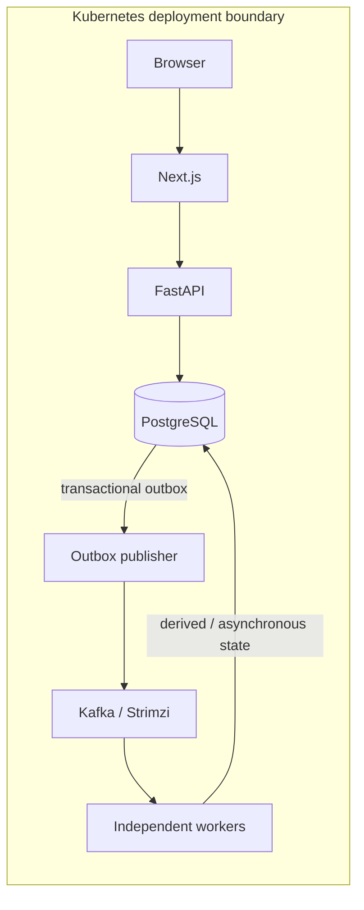
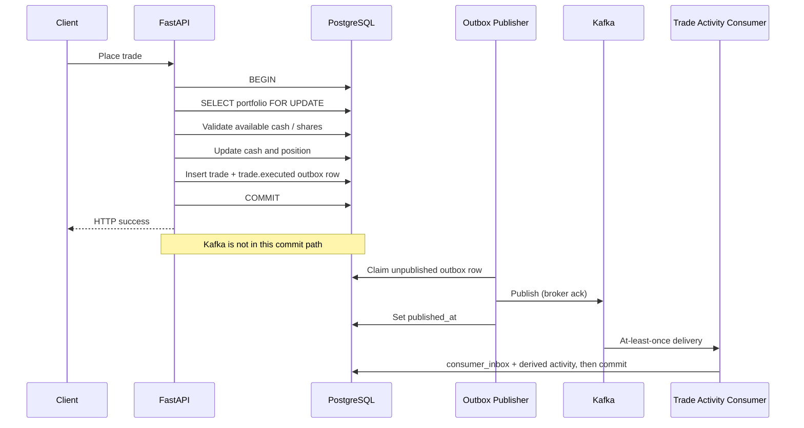
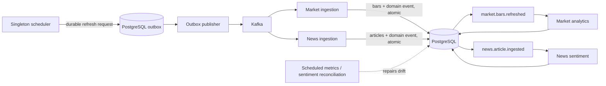

# StockViz

A full-stack market analytics and paper-trading platform built to explore strongly consistent financial transactions, event-driven processing, and independently scalable Kubernetes workers.

## Measured evidence


StockViz combines a usable Next.js financial application with a deliberately split consistency model: money and positions commit synchronously in PostgreSQL, while Kafka carries durable asynchronous work and derived events. The complete stack is locally validated on a real single-node kind cluster with Strimzi.

## What makes this project interesting

- **Strongly consistent trading ledger.** PostgreSQL row locks, cash/share reservations, and one transaction for cash, positions, trades, and the outbox prevent concurrent portfolio overcommit.
- **Deterministic backtesting.** Strategies replay stored daily bars with explicit commission, slippage, and a buy-and-hold benchmark without using future data.
- **Transactional outbox.** A committed trade cannot lose its event because publication is retried independently after the financial transaction.
- **At-least-once Kafka processing.** Consumer inbox rows make duplicate delivery safe; application keys retain useful portfolio/ticker ordering.
- **Event-driven ingestion.** The scheduler emits durable market/news requests; dedicated workers call providers, persist results, and publish downstream domain events.
- **Kubernetes orchestration.** API, web, migration, scheduler, publisher, and consumers have distinct workloads, probes, disruption policies, and appropriate scaling limits.
- **Measured scaling.** A 100,000-event, 12-partition benchmark compares 1/2/4/8 consumer replicas with throughput, latency, lag, CPU, and memory evidence.

## Architecture



The synchronous ledger and asynchronous pipelines are intentionally separate. See [Event-driven architecture](./docs/EVENT_DRIVEN_ARCHITECTURE.md), [Kubernetes](./docs/KUBERNETES.md), and the [interview guide](./docs/INTERVIEW_GUIDE.md).

## Financial correctness

A trade request locks its portfolio row, validates available cash or shares after pending-order reservations, updates balances and positions, inserts the trade, and inserts `trade.executed` into the outbox—all in one PostgreSQL transaction. Any failure rolls the entire operation back. Only after `COMMIT` does the HTTP request succeed.

Kafka is **not** in the trade commit path and never executes trades. PostgreSQL remains the financial source of truth.



## Event-driven processing

The outbox closes the database/Kafka dual-write gap: application state and the event intent commit together, and a publisher retries until the broker acknowledges. A crash after Kafka acknowledgement but before `published_at` can publish a duplicate, so consumers atomically insert a durable inbox key with their derived writes before committing the Kafka offset.

Trades are keyed by `portfolio_id`; market and news events are keyed by `ticker`. Kafka ordering is partition-local, so these keys keep each portfolio or ticker ordered without promising global order.



## Kubernetes lab

The kind reference separates the FastAPI and Next.js Deployments from a singleton scheduler, one-shot migration Job, outbox publisher, trade-activity consumer, market/news ingestion and analytics workers, and sentiment workers. Strimzi runs Kafka 3.9.0. Readiness can depend on PostgreSQL; `/live` is process liveness and deliberately does not. The market-ingest HPA caps at three replicas because its domain topic has three partitions.

This is a locally and CI-validated deployment reference—not a cloud, multi-zone, or production-capacity claim.

## Kafka scaling results

Environment: kind v0.27.0, Kubernetes v1.32.2, Strimzi 0.45.1, Kafka 3.9.0, one node, one broker, 12 benchmark partitions, 100,000 events per run.

<!-- kafka-benchmark-table:start -->
| Replicas | Events | Consumer events/sec | p50 | p95 | Peak lag | Peak CPU/pod | Peak memory/pod |
| ---: | ---: | ---: | ---: | ---: | ---: | ---: | ---: |
| 1 | 100,000 | 1,562.80 | 36,267.1 ms | 58,144.1 ms | 99,251 | 450m | 79Mi |
| 2 | 100,000 | 2,915.44 | 18,140.5 ms | 30,042.1 ms | 100,000 | 418m | 52Mi |
| 4 | 100,000 | 3,234.39 | 16,462.1 ms | 27,685.2 ms | 99,072 | 248m | 41Mi |
| 8 | 100,000 | 3,052.10 | 16,393.6 ms | 27,696.1 ms | 97,298 | 213m | 79Mi |
<!-- kafka-benchmark-table:end -->

All four runs collected exactly 100,000 current-run records, counted zero foreign records, and drained final lag to zero. Throughput improved sharply from one to two replicas, flattened at four, and regressed 5.6% at eight on the single-node/single-broker lab. See the [methodology and full interpretation](./docs/KAFKA_SCALING.md).

## Features

- Markets dashboard, ticker charts, indicators, comparison, screener, news, watchlists, and in-app price alerts
- Email/password authentication with optional Google OAuth
- FX-aware equity paper trading, pending limit/stop/take-profit orders, dividends, portfolio analytics, and leaderboard
- Long-only Black-Scholes options priced with a historical-volatility proxy
- Configurable, look-ahead-safe strategy backtesting
- Rule-based technical and optional sentiment recommendations

## Tech stack

| Layer         | Technologies                                                                 |
| ------------- | ---------------------------------------------------------------------------- |
| Web           | Next.js 16, React 19, TypeScript, Tailwind CSS, NextAuth, lightweight-charts |
| API           | FastAPI, SQLModel, Alembic, APScheduler, Pyright, Ruff                       |
| Data          | PostgreSQL 16, yfinance, Alpha Vantage fallback, Newsdata.io                 |
| Events        | Kafka 3.9, transactional outbox, idempotent consumer inbox                   |
| Orchestration | Kubernetes, kind, Strimzi, Kustomize, HPA/PDB/probes                         |
| Testing       | pytest, Vitest, Playwright, real PostgreSQL/Kafka integration                |

## Running locally

Prerequisites: Node/pnpm, Python 3.12+/uv, and Docker. Copy `apps/web/.env.example` to `apps/web/.env.local` and `apps/api/.env.example` to `apps/api/.env` first.

### 1. Simple development: PostgreSQL + API + web

```bash
pnpm install
uv --directory apps/api sync
pnpm db:up
uv --directory apps/api run alembic upgrade head
uv --directory apps/api run python -m stockviz.cli seed
uv --directory apps/api run python -m stockviz.cli backfill
pnpm api:dev      # terminal 1
pnpm dev:web      # terminal 2
```

### 2. Event-driven development: add Kafka + workers

```bash
pnpm events:up
pnpm events:publisher       # separate terminals
uv --directory apps/api run python -m stockviz.workers.trade_activity_consumer
pnpm events:market-ingest
pnpm events:market-analytics
pnpm events:news-ingest
pnpm events:news-sentiment
```

### 3. Full Kubernetes lab: kind + Strimzi

```bash
pnpm k8s:create
pnpm k8s:build
pnpm k8s:deploy
pnpm k8s:smoke
```

See [setup](./docs/SETUP.md) for Windows equivalents and environment variables, or [Kubernetes](./docs/KUBERNETES.md) for cluster internals and teardown.

## Testing and CI

GitHub Actions exercises frontend lint, type checking, unit tests, and production build; API lint, formatting, type checking, pytest, migration drift and head checks; real PostgreSQL concurrency; real trade/market/news Kafka integration; Playwright; API and web image builds; and a real kind + Strimzi smoke deployment. Local entry points:

```bash
pnpm lint
pnpm typecheck
pnpm --filter @stockviz/web test
uv --directory apps/api run pytest
pnpm build
```

## Engineering tradeoffs and limitations

What is demonstrated: local Docker, real PostgreSQL and Kafka, a real kind/Strimzi cluster, multi-consumer benchmark evidence, and CI smoke coverage.

What is not demonstrated: cloud Kubernetes, multi-node Kafka HA, multi-AZ PostgreSQL, production traffic, managed secrets, a full observability stack, or production SLOs. Market data is end-of-day rather than exchange-grade; options and backtests intentionally use simplified fill/pricing models. Read the current [known limitations](./docs/KNOWN_LIMITATIONS.md), [technical audit](./docs/TECHNICAL_AUDIT.md), and [resume-safe project copy](./docs/RESUME.md).

## License

MIT — see [LICENSE](./LICENSE).
