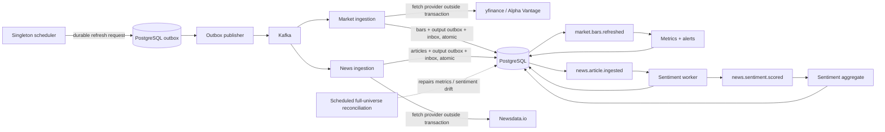

# Event-driven architecture

StockViz uses Kafka for asynchronous orchestration and derived processing. PostgreSQL remains the source of truth for price bars, news, sentiment, metrics, and every financial ledger row. Kafka is not in the trade commit path.

## Market and news pipeline



The reconciliation path is intentionally separate from the incremental event path. It repairs drift without making Kafka the source of truth.

## Trade commit path

Trade execution is independently strongly consistent:

```text
FastAPI -> BEGIN -> lock portfolio -> validate reservations
        -> update cash/position -> insert trade + outbox -> COMMIT
```

Only later does the outbox publisher send `trade.executed`. The trade-activity consumer writes derived activity, never ledger cash, positions, or orders.

## Events and keys

Control events are durable requests; domain events state that PostgreSQL changed.

| Event                      | Topic                | Key          | Producer             | Consumer group                    | Side effect                |
| -------------------------- | -------------------- | ------------ | -------------------- | --------------------------------- | -------------------------- |
| `market.refresh.requested` | `stockviz.market.v1` | ticker       | scheduler/CLI outbox | `stockviz.market-ingestion.v1`    | fetch and upsert bars      |
| `market.bars.refreshed`    | `stockviz.market.v1` | ticker       | market ingestion     | `stockviz.market-analytics.v1`    | ticker metrics and alerts  |
| `news.refresh.requested`   | `stockviz.news.v1`   | ticker       | scheduler/CLI outbox | `stockviz.news-ingestion.v1`      | fetch and insert headlines |
| `news.article.ingested`    | `stockviz.news.v1`   | ticker       | news ingestion       | `stockviz.news-sentiment.v1`      | score one article          |
| `news.sentiment.scored`    | `stockviz.news.v1`   | ticker       | sentiment worker     | `stockviz.sentiment-aggregate.v1` | ticker sentiment rollup    |
| `trade.executed`           | `stockviz.trades.v1` | portfolio_id | trading transaction  | `stockviz.trade-activity.v1`      | derived portfolio activity |

Kafka orders within a partition. Ticker and portfolio keys preserve useful domain-local order while unrelated entities progress concurrently.

One `market.bars.refreshed` is emitted per successful ticker refresh, not per OHLCV row. One `news.article.ingested` is emitted only for a newly inserted URL; a uniqueness conflict creates no event.

## Scheduler responsibilities

`daily_price_refresh`, `hourly_top_movers`, and `news_refresh` insert control events into the outbox and commit. They do not call providers or publish directly to Kafka. If Kafka is unavailable, these durable requests remain in PostgreSQL.

Financial jobs—FX, pending-order settlement, dividends, option expiry, portfolio snapshots—and universe-wide recommendations remain scheduled/PostgreSQL operations by design. Symbol-metrics and sentiment-aggregate schedules remain reconciliation paths.

On Kubernetes the scheduler runs as its own one-replica Deployment; API pods set `ENABLE_SCHEDULER=false`. Other environments may enable the same scheduler in the API process. PostgreSQL advisory locks prevent overlapping money-moving jobs.

## Transaction boundaries

Every side-effecting consumer commits one PostgreSQL transaction containing:

1. its domain or derived writes;
2. any output outbox rows;
3. its durable inbox receipt `(consumer_name, event_id)`.

Only after the database commit succeeds does it commit the Kafka offset. Provider HTTP occurs before the database transaction: fetch first, then atomically persist.

Atomic units include:

- market ingestion: bar upserts + `market.bars.refreshed` outbox + inbox;
- market analytics: ticker metrics + matching alerts + inbox;
- news ingestion: inserted articles + their output events + inbox;
- news sentiment: score + article label + output event + inbox;
- sentiment aggregate: ticker sentiment fields + inbox;
- synchronous trade: ledger + `trade.executed` outbox.

## Delivery and failure semantics

Publication and consumption are at least once:

- publisher crash after broker acknowledgement but before `published_at`: the outbox row publishes again;
- consumer crash after database commit but before offset commit: Kafka redelivers and the inbox suppresses the duplicate side effect;
- provider failure before database commit: no result is recorded, the offset remains uncommitted, and the worker backs off;
- duplicate scheduled requests have distinct event IDs, but bar upserts and article URL uniqueness keep persistence idempotent.

There is no retry topic or dead-letter queue. A poison record can stall one partition until corrected.

## Sentiment-disabled behavior

When the provider is `none`, the sentiment consumer records the inbox receipt but emits no fake score or downstream event. Articles remain available for later backfill. A configured provider error does not create a score and does not commit the Kafka offset.

## Local operation

Docker Compose's `events` profile starts one KRaft Kafka node with auto-create disabled and three-partition domain topics:

```bash
pnpm events:up
pnpm events:publisher
pnpm events:market-ingest
pnpm events:market-analytics
pnpm events:news-ingest
pnpm events:news-sentiment
pnpm events:sentiment-aggregate
```

Kubernetes places the same processes in separate Deployments; it does not change consistency or delivery semantics. See [Kubernetes](./KUBERNETES.md) and [Kafka scaling](./KAFKA_SCALING.md).
