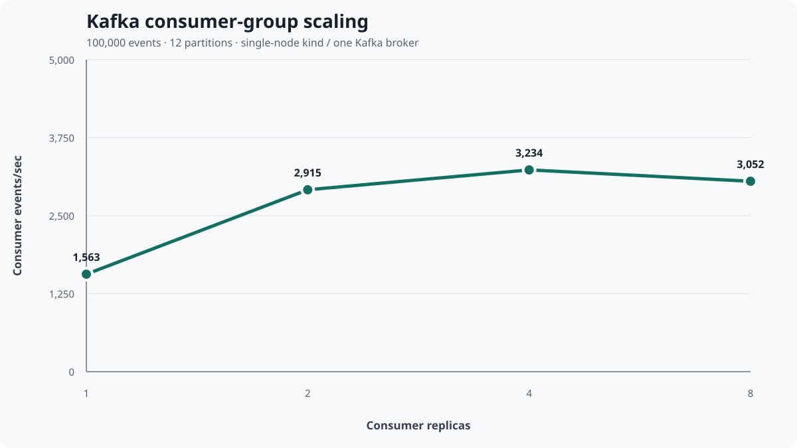

# Kafka consumer-group scaling

This experiment measures how a Kubernetes consumer group shares a 12-partition synthetic topic as replicas increase from 1 to 2, 4, and 8. It measures Kafka consumer mechanics—not provider ingestion, the trading ledger, or production capacity.

## Measured environment

| Component       | Value                                          |
| --------------- | ---------------------------------------------- |
| Host model      | One local machine                              |
| kind            | v0.27.0                                        |
| Kubernetes      | v1.32.2                                        |
| Nodes           | 1 control-plane node                           |
| Strimzi         | 0.45.1                                         |
| Kafka           | 3.9.0, KRaft                                   |
| Brokers         | 1, replication factor 1                        |
| Benchmark topic | `stockviz.benchmark.v1`, 12 partitions         |
| Result topic    | `stockviz.benchmark-results.v1`, 12 partitions |
| Workload        | 100,000 events per replica count               |
| Generated       | 2026-08-26 15:51:50 UTC                        |

The committed source artifact is [`artifacts/benchmarks/kafka-scaling-100k.json`](../artifacts/benchmarks/kafka-scaling-100k.json). The table and chart are generated from that JSON; a validator fails on missing/incomplete rows or documentation drift.

## Results

<!-- kafka-benchmark-table:start -->
| Replicas | Events | Consumer events/sec | p50 | p95 | Peak lag | Peak CPU/pod | Peak memory/pod |
| ---: | ---: | ---: | ---: | ---: | ---: | ---: | ---: |
| 1 | 100,000 | 1,562.80 | 36,267.1 ms | 58,144.1 ms | 99,251 | 450m | 79Mi |
| 2 | 100,000 | 2,915.44 | 18,140.5 ms | 30,042.1 ms | 100,000 | 418m | 52Mi |
| 4 | 100,000 | 3,234.39 | 16,462.1 ms | 27,685.2 ms | 99,072 | 248m | 41Mi |
| 8 | 100,000 | 3,052.10 | 16,393.6 ms | 27,696.1 ms | 97,298 | 213m | 79Mi |
<!-- kafka-benchmark-table:end -->



Every row collected exactly 100,000 matching records, reported `foreign_records = 0` and `complete = true`, had positive processing duration and current-run throughput/latency, and ended with final lag zero.

## What the curve says

Two replicas reached 2,915 events/sec, 1.87× the single replica. Four reached 3,234 events/sec, only 10.9% above two. Eight reached 3,052 events/sec—5.6% below four—with essentially unchanged p95 latency. The honest conclusion is strong initial parallelism followed by a plateau and a small regression in this constrained lab.

Likely shared bottlenecks include the single Kafka broker, single kind node, JSON serialization, result-topic writes, consumer offset commits, CPU scheduling, networking, and consumer-group coordination. The experiment does not isolate those causes, so it should not be used for production capacity planning.

## Methodology and run isolation

Each replica count uses a new consumer group and a distinct `run_id`. Before producing, the coordinator assigns all topic partitions, seeks the group to the current end, and commits those offsets. Consumers also filter by `run_id`; a non-matching same-group record is counted as foreign and fails the run.

The 100,000 records use 1,000 round-robin synthetic keys (`SYM0000`–`SYM0999`) so the benchmark does not accidentally pin the workload to a few partitions. Each consumer parses JSON, writes a result record containing the processing timestamp, and commits its offset. The coordinator samples group lag and `kubectl top` while work is active.

Metrics mean:

- `producer_events_per_second`: producer send-and-flush rate, not consumer throughput.
- `processing_duration_seconds`: `max(consumed_at) - min(produced_at)` for this run only.
- `consumer_events_per_second`: 100,000 divided by that current-run duration.
- latency percentiles: `consumed_at - produced_at` for current-run records.
- peak lag: largest sampled difference between partition watermarks and committed offsets.
- CPU/memory: highest per-pod sample from `kubectl top`; the schema permits `null` when metrics are unavailable.

Run the full matrix without changing the methodology:

```bash
pnpm k8s:create
pnpm k8s:build
pnpm k8s:deploy
BENCHMARK_COUNT=100000 BENCHMARK_REPLICAS="1 2 4 8" pnpm k8s:benchmark
```

Validate the artifact, regenerate the chart, and verify both tables:

```bash
uv run --project apps/api python -m stockviz.benchmarks.report \
  --input artifacts/benchmarks/kafka-scaling-100k.json \
  --chart docs/images/kafka-consumer-throughput.svg \
  --check-markdown README.md \
  --check-markdown docs/KAFKA_SCALING.md
```

## Consumer parallelism and partition ceilings

Useful consumer concurrency in one group is bounded by its partition count. The benchmark has 12 partitions, so 1, 2, 4, and 8 replicas can all own work; more replicas are not automatically faster because shared resources and coordination still matter.

The domain topics deliberately remain at three partitions:

| Domain topic         | Partitions | Key            |
| -------------------- | ---------: | -------------- |
| `stockviz.trades.v1` |          3 | `portfolio_id` |
| `stockviz.market.v1` |          3 | `ticker`       |
| `stockviz.news.v1`   |          3 | `ticker`       |

That is why the market-ingest HPA caps at three replicas. The synthetic benchmark needs more parallelism for the experiment; it is not a reason to repartition domain topics.

## Ordering

Kafka ordering is partition-local, not global. Keying trade events by `portfolio_id` keeps one portfolio's activity in order. Keying market and news events by `ticker` keeps one symbol's updates in order. Unrelated portfolios or tickers can progress concurrently.

## Rebalancing

When replicas join or leave, the group coordinator reassigns partitions. Startup, assignment, cache warm-up, and pauses during rebalance are real fixed costs. They matter most for short runs and help explain why additional replicas can fail to pay back their coordination overhead.

## Lag

Peak lag captures the backlog while the 100,000-event burst is in flight; values near the event count show consumers temporarily had nearly the full batch waiting. Final lag zero proves each group drained the workload before the run was marked complete. A final zero alone would hide how much backlog accumulated, which is why both metrics are retained.

## CPU HPA is a demonstration

The market-ingest HPA scales on CPU because metrics-server is available in the kind lab. Kafka consumers often wait on broker, database, or provider I/O, so CPU can remain low while lag grows. A real production deployment would normally consider lag-based autoscaling; KEDA is one possible future tool, but it is intentionally not installed here.

## Scope and caveats

This is one complete run on one local machine, one kind node, and one Kafka broker. It demonstrates correct measurement, isolation, consumer-group behavior, and a reproducible lab workflow. It does not demonstrate multi-broker HA, multi-node Kubernetes, cloud networking, production traffic, sustained capacity, or an SLO. Run-to-run variance was not measured, so the individual numbers should be treated as environment-specific observations.
