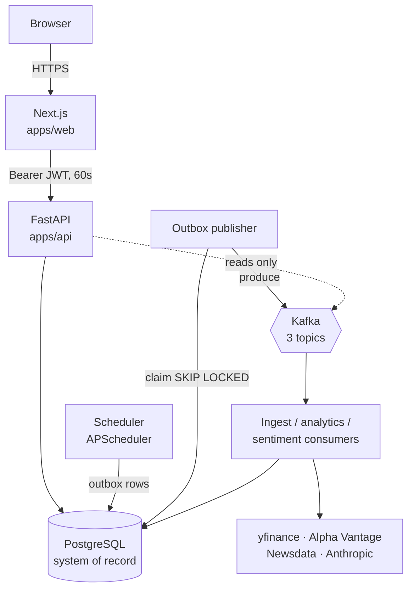

# Architecture overview

StockViz separates a **synchronous financial path** from an **asynchronous
data path**. That split is the single most important thing to understand
about the system, and nearly every other design choice follows from it.

- **Money is synchronous.** Cash, positions, orders, and trades commit in
  one PostgreSQL transaction inside the FastAPI request. Kafka is not
  required for a trade to be correct.
- **Data is asynchronous.** Market bars, news, sentiment, and derived
  analytics flow through a transactional outbox into Kafka and are applied
  by idempotent workers.

## Process inventory

Each row is a separately deployable process. In Kubernetes each is its own
Deployment (`infra/k8s/base/app/`); in Docker Compose they are compose
services; on Render the API runs the scheduler in-process instead.

| Process | Entry point | Role | State it owns |
| --- | --- | --- | --- |
| Web | `apps/web` (Next.js) | Pages, NextAuth session, server-side authed API calls | Session cookie |
| API | `stockviz.main:app` | All `/v1` endpoints; the trading ledger | Writes every domain table |
| Scheduler | `stockviz.workers.scheduler` | Cron jobs; enqueues refresh requests; settles orders/options/dividends | Outbox rows + financial settlement |
| Outbox publisher | `stockviz.workers.outbox_publisher` | Claims outbox rows, produces to Kafka, marks published | `outbox_events.published_at` |
| Market ingest | `stockviz.workers.market_ingest_consumer` | Fetches provider bars, upserts `price_bars` | Bars + `market.bars.refreshed` |
| Market analytics | `stockviz.workers.market_analytics_consumer` | Per-ticker metrics + alert evaluation | `symbol_metrics`, alerts |
| News ingest | `stockviz.workers.news_ingest_consumer` | Fetches articles, dedupes by URL | `news_articles` |
| News sentiment | `stockviz.workers.news_sentiment_consumer` | Scores articles via the sentiment provider | `news_sentiment` |
| Sentiment aggregate | `stockviz.workers.sentiment_aggregate_consumer` | Rolls scores into per-symbol averages | `symbol_metrics.sentiment_7d` |
| Trade activity | `stockviz.workers.trade_activity_consumer` | Derived per-portfolio counters | `portfolio_trade_activity` |

Every scheduled job also has a manual CLI twin (`python -m stockviz.cli
<cmd>`), so any job can be re-run by hand without a scheduler.

## System context

The dotted line is deliberate: **the API never produces to Kafka.** It
stages outbox rows inside the ledger transaction and lets the publisher
process deal with the broker. That is why the compose `api` service does
not set `KAFKA_BOOTSTRAP_SERVERS` — see
[EVENT_DRIVEN_ARCHITECTURE.md](../EVENT_DRIVEN_ARCHITECTURE.md).

## Service boundaries and why they sit where they do

| Boundary | Rule | Enforced by |
| --- | --- | --- |
| Browser ↔ API | The browser never holds an API credential | `apps/web/lib/api/server.ts` is `import "server-only"` |
| Web ↔ API | Identity is a signed claim, not a header | `stockviz/auth.py::require_user_id` verifies HS256 `sub` |
| Router ↔ service | Routers are thin; business logic is in `services/` | One file per resource on both sides |
| Ledger ↔ derived state | Consumers may only write derived rows | `models/events.py` docstring; `apply_fill` owns cash |
| Simulation ↔ everything | The kernel is pure — no Session, FX, settings, clock | `services/simulation/` imports |

The last two are the load-bearing ones. A Kafka consumer that could move
cash would turn an at-least-once pipeline into a double-spend bug; instead
consumers write only `symbol_metrics`, `news_*`, and
`portfolio_trade_activity`.

## Synchronous vs asynchronous, concretely

| Concern | Path | Why |
| --- | --- | --- |
| Placing a trade | Synchronous, one transaction | User needs read-your-write and a real failure message |
| Settling pending orders | Synchronous, scheduled | Moves money; must not double-fire |
| Options expiry, dividends, FX, NAV snapshots | Synchronous, scheduled | Same |
| Fetching bars from a provider | Async worker | Slow, flaky third-party I/O; must not block a request |
| Scoring news sentiment | Async worker | LLM latency and cost |
| Per-symbol metrics, alerts | Async worker + scheduled reconciliation | Incremental for freshness, full-universe to repair drift |

## Scaling boundaries

| Component | Scales by | Ceiling |
| --- | --- | --- |
| API | HPA on CPU, 2→5 replicas | Stateless; Postgres connections |
| Market/news consumers | HPA on CPU, 1→3 replicas | **Topic partitions (3)** — a 4th pod would idle |
| Scheduler | Does **not** scale — 1 replica | Advisory locks are defence-in-depth, not a design for N |
| Postgres | Vertical only in this repo | Single instance, no read replicas |

The consumer HPA `maxReplicas: 3` in
`infra/k8s/base/scale/market-ingest-hpa.yaml` matches
`MARKET_TOPIC_PARTITIONS = 3` in `events/contracts/market.py`. That
pairing is intentional — consumer-group parallelism cannot exceed the
partition count.

## Failure boundaries

| Failure | Blast radius | Behaviour |
| --- | --- | --- |
| Kafka down | Async data only | Trades still commit; outbox backs up and drains later |
| Provider down | One ticker's refresh | Handler raises, record is rewound and retried |
| Postgres down | Everything | `/health` returns 503, pods leave the Service; `/live` stays 200 so they are not killed |
| Publisher crash after broker ack | Duplicate event | Consumers dedupe on `consumer_inbox` |
| Consumer crash mid-batch | None | DB commits before the Kafka offset, so replay is harmless |

## Where to read next

- [Request lifecycle](./request-lifecycle.md) — the same flows traced
  through actual functions.
- [EVENT_DRIVEN_ARCHITECTURE.md](../EVENT_DRIVEN_ARCHITECTURE.md) —
  transaction boundaries and delivery semantics in detail.
- [KNOWN_LIMITATIONS.md](../KNOWN_LIMITATIONS.md) — what this architecture
  does *not* give you.
