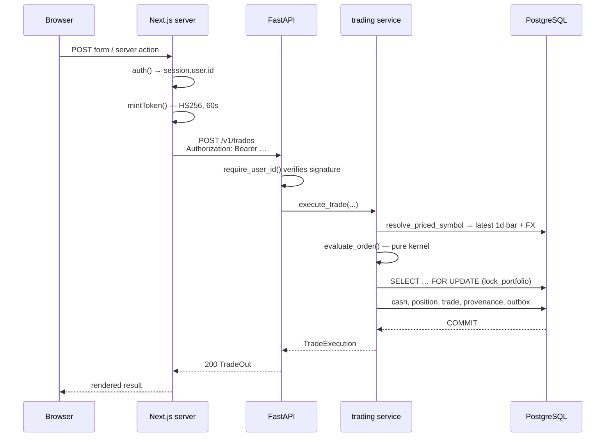
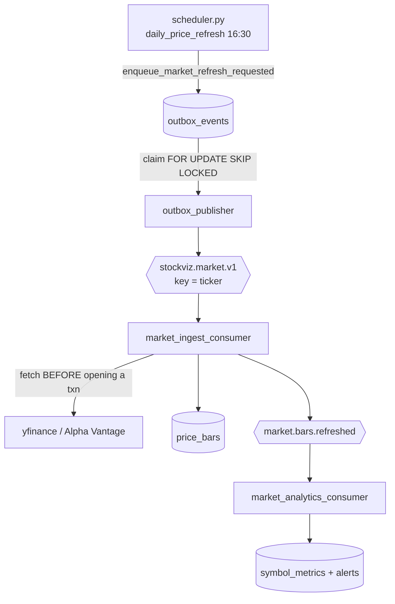

# Request lifecycle

Five traces through real files and functions. Every arrow is checkable —
open the file at the named symbol.

---

## 1. Authenticated write: placing a market BUY

The most important path in the system. Everything that touches money
follows this shape.



### Step by step

| # | Where | What happens |
| --- | --- | --- |
| 1 | `apps/web/lib/api/server.ts::authedFetch` | Reads the NextAuth session. No session → `UnauthenticatedError`. |
| 2 | `apps/web/lib/api/server.ts::mintToken` | Signs `{ sub: userId }` with `INTERNAL_API_TOKEN`, 60 s expiry. The browser never sees this token — the module is `import "server-only"`. |
| 3 | `apps/api/src/stockviz/auth.py::require_user_id` | Verifies HS256 and returns `int(payload["sub"])`. A forged user id requires the shared secret. |
| 4 | `routers/trading.py` | Thin: validates `TradeIn`, calls the service, maps domain errors to HTTP. |
| 5 | `services/trading/execute.py::execute_trade` | Resolves the latest `1d` bar and FX rate, asks the kernel for a fill price. |
| 6 | `services/simulation::evaluate_order` | **Pure function.** No Session, no FX, no settings, no wall clock. Returns a `FillDecision`. |
| 7 | `services/trading/execute.py::apply_fill` | `lock_portfolio` takes `SELECT … FOR UPDATE` and *refreshes* the identity-map instance, then checks **available** cash (ledger minus other orders' reservations) and mutates cash + position. |
| 8 | `services/trading/execution_provenance.py` | Snapshots the same `FillDecision` as a `SimulatedExecution` row. |
| 9 | `events/outbox.py::enqueue_trade_executed` | Stages a `trade.executed` outbox row **in the same transaction**. |
| 10 | `execute_trade` | `session.commit()` — ledger, provenance, and event intent commit atomically or not at all. |

### Why the lock refresh matters

`lock_portfolio` does not just lock; it refreshes. Without the refresh,
SQLAlchemy's identity map could hand back a `cash_balance` read *before*
the lock was acquired, and writing it back would silently overwrite a
concurrent debit. This is a classic lost-update, and it is why
`test_pg_concurrency.py` exists.

### Failure modes

| Failure | Result |
| --- | --- |
| Insufficient available cash | `InsufficientCash` raised **before** any mutation → 400, session reusable |
| No FX rate for a non-USD symbol | `NoFxRateError` → hard failure, no guessed rate |
| Kernel does not fully fill | `TradeExecutionError` — never a partial silent fill |
| Kafka down | Irrelevant. The outbox row is committed; the publisher drains later |

---

## 2. Public read: a symbol's price chart

```
Browser → apps/web/lib/api/<resource>.ts (apiGet, no auth)
        → GET /v1/bars/{ticker}
        → routers/bars.py  (@limiter.limit — 60/min)
        → SELECT … FROM price_bars WHERE ticker = ? AND interval = ? ORDER BY ts
        → ix_price_bars_ticker_interval_ts
```

Public routers are rate-limited with slowapi; authenticated routers are
deliberately **not**, because every authed request arrives from the
Next.js server and a per-IP limit would be one global bucket for all
users. Where per-user throttling matters it is done in the router — see
`routers/comments.py` (5 posts/min via a DB count).

`limiter.py::client_key` keys on the JWT `sub` when present, then the
left-most `X-Forwarded-For` hop, then the socket address. Uvicorn runs
with `--proxy-headers` so the forwarded chain is populated.

---

## 3. Scheduled ingest: market bars, end to end

This is the async path, and it crosses three processes.



### The ordering rules that make this safe

1. **Scheduler does no provider I/O.** `daily_price_refresh` only writes
   outbox rows. A slow provider cannot wedge the scheduler thread.
2. **Publisher marks published only after a broker ack**
   (`events/outbox.py::publish_batch`). Crash between ack and commit →
   the row republishes. At-least-once, by design.
3. **Consumers fetch outside the transaction.**
   `market_ingest_consumer.py::process_payload` calls
   `fetch_bars_for_event` *before* `with Session(engine)`. A provider
   timeout therefore holds no database transaction open.
4. **DB commits before the Kafka offset.**
   `events/dispatcher.py::consume_once` commits the session, then calls
   `client.commit(msg)`. Crash in between → the record replays and the
   inbox key makes it a no-op.
5. **A failed record is rewound, not skipped.** See
   [ADR-0005](../adr/ADR-0005-rewind-on-handler-failure.md).

### Idempotency

`events/handlers.py::persist_market_refresh` checks
`already_processed(...)` first and `try_record_processed(...)` last, both
against `consumer_inbox` keyed `(consumer_name, event_id)`. The unique
constraint is the real guard — the leading read is just a cheap
short-circuit. Bars themselves are upserted on the
`(ticker, ts, interval)` primary key, so replaying an event rewrites
identical rows rather than duplicating them.

---

## 4. Scheduled settlement: pending orders

Unlike ingest, this stays synchronous and in-process because it moves
money.

```
scheduler.py  16:45  pending_orders_settlement
  └── @single_instance → pg_try_advisory_lock(sha256(job_id))
      └── services/trading/orders.py::settle_pending_orders(session_date)
          ├── for each PENDING order:
          │     ├── latest bar older than session_date? → leave PENDING
          │     ├── evaluate_order(...)  (pure kernel)
          │     └── triggered → apply_fill(..., exclude_order_id=order.id)
          │           └── fails validation → CANCELLED with cancel_reason
          └── session.commit()
```

Two details worth internalising:

- **`exclude_order_id`** lets a filling order consume *its own* cash or
  share reservation while still respecting every other pending order's.
- **`session_date`** guards against a failed price refresh. If the latest
  bar predates the session, orders stay pending rather than filling
  against a stale close — a real data-quality guard, not a nicety.

The advisory lock is what makes it safe for the scheduler to exist at all:
APScheduler runs in-process, so on Render (`ENABLE_SCHEDULER=true`) two
API instances would otherwise both fire order settlement and fill the same
order twice. Kubernetes additionally runs the scheduler as a 1-replica
Deployment with `ENABLE_SCHEDULER=false` on API pods.

---

## 5. Streaming: the simulated quote ticker

```
Browser EventSource → GET /v1/stream/quotes/{ticker}
                    → routers/stream.py — SSE generator
                    → Gaussian random walk seeded from the latest 1d close
```

This is **not** an exchange feed and the UI labels it as simulated. It
reads the latest stored close and walks from it. No Kafka, no provider,
no WebSocket — a plain SSE response. See
[KNOWN_LIMITATIONS.md](../KNOWN_LIMITATIONS.md).

---

## Cross-cutting: where a request can be rejected

| Layer | Rejection | File |
| --- | --- | --- |
| Web | No session | `lib/api/server.ts::authedFetch` |
| Web | Dev secret in production build | `lib/env.ts::requireSecret` |
| API | Bad/expired JWT | `auth.py::require_user_id` |
| API | Rate limit | `limiter.py` + `@limiter.limit` |
| Service | Domain invariant | `TradeExecutionError` subclasses |
| DB | Constraint | PK on `(ticker, ts, interval)`, unique `consumer_inbox`, unique `news_articles.url` |
