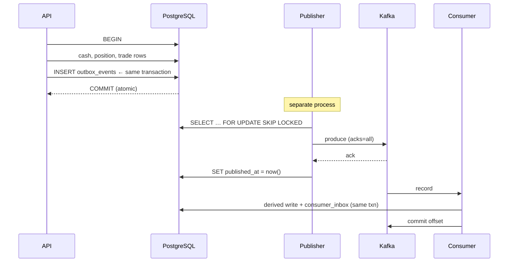

# Outbox, delivery semantics, and idempotency

> **Before this note:** read
> [EVENT_DRIVEN_ARCHITECTURE.md](../../EVENT_DRIVEN_ARCHITECTURE.md),
> [ADR-0002](../../adr/ADR-0002-transactional-outbox.md), and
> [ADR-0003](../../adr/ADR-0003-consumer-inbox-idempotency.md).
> **Source:** `apps/api/src/stockviz/events/outbox.py`,
> `events/inbox.py`, `events/handlers.py`.

This is the highest-value topic in the repository. If you learn one thing
deeply, learn this.

## The problem it solves

You must do two things: commit a trade to Postgres, and tell the rest of
the system it happened. There is no transaction spanning both.

```
commit(PG) then produce(Kafka)   → crash between = event lost forever
produce(Kafka) then commit(PG)   → rollback = event published for a trade that never happened
```

This is the **dual-write problem**, and it has no solution that keeps both
writes and stays atomic. The outbox pattern sidesteps it: make the second
write part of the first.

## How StockViz does it



The three ordering rules, and what each buys:

| Rule | Code | Prevents |
| --- | --- | --- |
| Outbox row commits **with** the ledger | `enqueue_trade_executed` (no commit of its own) | Lost or phantom events |
| `published_at` set **after** the broker ack | `publish_batch` | Marking published something Kafka never got |
| DB commits **before** the Kafka offset | `dispatcher.py::consume_once` | Applying an event whose DB work was rolled back |

Notice all three are the *same* principle: **commit the recoverable thing
last.** Whatever you commit last is the thing you may repeat; make sure
repeating it is safe.

## Why this is at-least-once, not exactly-once

Look at the window between the broker ack and the `published_at` commit.
Crash there and the row is still unpublished, so it publishes again. The
codebase states this in `ConfluentBrokerPublisher`'s docstring rather than
pretending otherwise.

`enable.idempotence=True` on the producer is often misread as fixing this.
It does not. It deduplicates **broker-side retries within one producer
session**; it knows nothing about your database, so it cannot help with a
crash between ack and commit. Being able to make this distinction cleanly
is a strong signal in an interview.

**Exactly-once end-to-end is not achievable here** because the side effect
(a Postgres write) is outside Kafka's transaction boundary. What you can
have is *effectively-once*: at-least-once delivery plus idempotent
application. That is what the inbox provides.

## The inbox half

```python
# events/handlers.py — every handler has this shape
if already_processed(session, event_id=..., consumer_name=...):
    return "duplicate"
...domain change...
if not try_record_processed(session, event_id=..., consumer_name=...):
    return "duplicate"
return "applied"
```

Three details that are easy to miss and good to be asked about:

1. **The unique constraint is the guard, not the read.** Two workers can
   both pass `already_processed`. Only
   `UniqueConstraint(consumer_name, event_id)` actually serialises them.
   The read is a cheap short-circuit.
2. **`begin_nested()` is load-bearing.** `try_record_processed` inserts
   inside a SAVEPOINT. Without it, the `IntegrityError` would poison the
   entire outer transaction, so the "duplicate" path would abort the work
   it was supposed to protect.
3. **The key is `(consumer_name, event_id)`**, not `event_id`. Each
   consumer group must see every event independently.

## Layered idempotency

The inbox is not the only defence — StockViz has three, at different
layers:

| Layer | Mechanism | Protects |
| --- | --- | --- |
| Storage | `price_bars` PK + `ON CONFLICT` | Replayed bar writes |
| Storage | `news_articles.url` unique | Re-ingested articles |
| Message | `consumer_inbox` | Counters, paid API calls |

Bars would survive replay *without* the inbox. Counters would not — which
is exactly why `portfolio_trade_activity` needs it. Being able to say
which writes are naturally idempotent and which need a message-level key
is the mark of someone who has actually built this.

## Trade-offs

| Choice | Cost |
| --- | --- |
| Outbox table | An extra write per event; a table that grows; a publisher process to operate |
| Polling publisher | Latency floor = poll interval. CDC/Debezium avoids it, at much higher operational cost |
| At-least-once | Every consumer must be idempotent, forever. That is a permanent design constraint |
| Partial index | Keeps the publisher's query fast, but only because the query always filters `published_at IS NULL` |

## Failure scenarios to be able to walk through

| Scenario | Outcome |
| --- | --- |
| Crash after ledger commit, before publish | Row pending; publisher picks it up. **No loss.** |
| Crash after broker ack, before `published_at` | Republished. Consumer's inbox makes it a no-op. |
| Two publishers running | `SKIP LOCKED` gives them disjoint rows. Safe by design. |
| Consumer crash after DB commit, before offset commit | Record replays; inbox returns `duplicate`. |
| Consumer crash after offset commit, before DB commit | **Cannot happen** — the DB commits first. This is the whole point of the ordering. |
| Kafka down for an hour | Backlog in Postgres, drains later. Trading unaffected. |

## Interview questions

**Foundation — "What is the dual-write problem?"**
> Two systems, one logical operation, no shared transaction. Either order
> of writes has a crash window that loses or fabricates an event.

**Strong SWE — "Why not just publish inside the request?"**
> It reintroduces the dual write, and it puts broker latency and
> availability in the user's request path. In StockViz the API doesn't
> even import the Kafka producer — the outbox row is the handoff, so a
> broker outage degrades data freshness but never blocks a trade.

**Strong SWE — "You said at-least-once. Doesn't `enable.idempotence` make it exactly-once?"**
> No. That deduplicates producer retries within a session. My duplicate
> window is between the broker ack and my `published_at` commit, which
> Kafka can't see. I get effectively-once by pairing at-least-once
> delivery with an idempotent consumer, keyed `(consumer_name, event_id)`
> in the same transaction as the derived write.

**Advanced — "Two consumer replicas get the same event. Walk me through it."**
> They can't, in the normal case — same group, one partition per key, so
> only one member owns it. If a rebalance duplicates delivery, both may
> pass the `already_processed` read, but only one wins the unique
> constraint. The loser's insert raises inside a SAVEPOINT, is caught, and
> returns "duplicate" without poisoning its transaction.

**Advanced — "Your outbox table grows forever. What breaks first?"**
> Nothing on the write path, because `ix_outbox_events_unpublished` is
> partial — it only indexes pending rows, so publisher latency is
> independent of history. What degrades is storage and any full-table
> query. The fix is archiving published rows, and I'd alert on backlog
> *age* rather than count.

## Memorise vs understand

**Memorise:** the three ordering rules; `SKIP LOCKED`; `(consumer_name,
event_id)`; at-least-once + idempotent = effectively-once.

**Understand:** why the last commit is the repeatable one; why producer
idempotence doesn't span the database; why the unique constraint rather
than the read is the guard.
