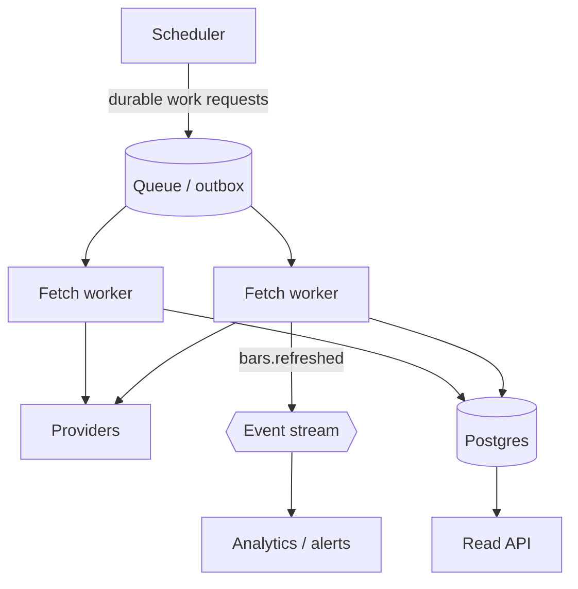

# Design: a market-data ingestion system

> Compare with [EVENT_DRIVEN_ARCHITECTURE.md](../../EVENT_DRIVEN_ARCHITECTURE.md)
> and [market-data semantics](../../database/market-data.md).

## 1. Clarify

- Which intervals? **Daily changes everything vs. intraday.**
- How many symbols? 50, 8,000, or global?
- How fresh must data be — end of day, or seconds?
- Do we need corrections and restatements?
- One provider or several?

Assume: 8,000 US symbols, daily bars, EOD freshness, multiple providers,
corrections must be handled.

## 2. Functional requirements

- Fetch daily OHLCV for every active symbol after the close.
- Support backfill of arbitrary history.
- Deduplicate: re-running must not corrupt data.
- Handle provider failure without losing symbols.
- Record which provider supplied each bar.
- Accept corrections to historical bars.

## 3. Non-functional

| Property | Target | Reasoning |
| --- | --- | --- |
| Completeness | **Highest priority** | A missing bar silently corrupts charts, fills, and analytics |
| Freshness | Minutes after close | Not a trading feed |
| Consistency | Strong within a symbol | A partially written day is worse than no day |
| Availability | Ingestion may lag; reads must not | Decouple them |
| Idempotency | **Required** | Retries and replays are certain |

Completeness over freshness is the defining choice, and it should drive
every later decision.

## 4. Estimation

```
8,000 symbols × 1 bar/day × 100 bytes   ≈ 800 KB/day
                                        ≈ 200 MB/year
                                        ≈ 2 GB for 10 years
```

**This is tiny.** No sharding, no partitioning, no specialised store. The
load is not the data — it is **8,000 outbound HTTP calls in a window**,
against rate-limited third parties.

*Say this out loud in an interview.* The naive answer reaches for
time-series databases; the correct observation is that the bottleneck is
provider I/O and failure handling, not storage.

## 5. API

```
POST /ingest/refresh { tickers: [...], since?: date }   → 202 Accepted
GET  /bars/{ticker}?interval=1d&from=&to=               → bars
GET  /ingest/status                                     → per-symbol freshness
```

`202` matters: ingestion is asynchronous. Returning `200` would lie about
completion.

## 6. Data model

```sql
price_bars (
  ticker, ts, interval,        -- composite PK
  open, high, low, close,      -- NUMERIC, never float
  volume BIGINT,
  source TEXT
)
INDEX (ticker, interval, ts)   -- equality, equality, then ordered
```

The composite natural key **is** the idempotency mechanism: `ON CONFLICT
DO UPDATE` makes replay a no-op. See
[indexes and keys](../databases/indexes-and-keys.md).

## 7. Components



**The scheduler must not call providers.** It enqueues durable work
requests. Otherwise one slow provider wedges the scheduler thread and the
whole run is lost — and a crash mid-run loses every un-fetched symbol with
no record that the work was owed.

## 8. Scaling

| Pressure | Answer |
| --- | --- |
| 8,000 HTTP calls | Horizontal fetch workers; parallelism = partitions |
| Provider rate limits | Per-provider token bucket + circuit breaker |
| Write throughput | Batch upserts, chunked under the bind-parameter cap |
| Read load | Index covers it; add a replica before a cache |

## 9. Failure handling

| Failure | Response |
| --- | --- |
| Provider timeout | Retry with backoff; the work request is durable, so nothing is lost |
| Provider returns nothing | Ambiguous — holiday or outage. Mark processed, but **alert on staleness** |
| Bad data | Plausibility bounds before write |
| Worker crash | Request is unacknowledged; redelivered |
| Duplicate delivery | Upsert on the natural key |

## 10. What StockViz actually does

| Design element | StockViz | Where |
| --- | --- | --- |
| Scheduler enqueues, doesn't fetch | ✅ | `scheduler.py::daily_price_refresh` |
| Durable work requests | ✅ Transactional outbox | `events/outbox.py` |
| Queue | ✅ Kafka, keyed by ticker | `events/contracts/market.py` |
| Parallel fetch workers | ✅ 1–3, capped at partition count | `market-ingest-hpa.yaml` |
| Fetch outside the transaction | ✅ | `market_ingest_consumer.py::process_payload` |
| Idempotent write | ✅ Natural key + `ON CONFLICT` | `upsert_bars` |
| Message-level dedupe | ✅ `consumer_inbox` | `events/inbox.py` |
| Provider provenance | ✅ `price_bars.source` | `models/market.py` |
| Chunked bulk upsert | ✅ 1000 rows (bind-parameter cap) | `upsert_bars` |
| Downstream event | ✅ `market.bars.refreshed` | `events/handlers.py` |
| Multi-provider fallback | 🟡 Only when primary returns nothing | `services/ingest/prices.py` |
| Per-provider rate limiting | ❌ | — |
| Circuit breaker | ❌ | — |
| Plausibility bounds | ❌ | — |
| Staleness alert | ❌ | [observability](../../observability/overview.md) |
| Corrections history | ❌ Overwrites in place | [market-data](../../database/market-data.md) |

**Honest summary:** the durability and idempotency story is complete and
production-shaped. Provider-side resilience — rate limiting, circuit
breaking, data validation — and the staleness alert are the real gaps.

## Follow-ups

**"A provider returns a price 100× too high. What happens?"**
> It's stored and flows into fills, alerts, and NAV. There's no
> plausibility check — a genuine gap. I'd bound each bar against the prior
> close (say, reject >50% moves for a quarantine queue) and require
> `low ≤ open,close ≤ high`.

**"How do you know ingestion is broken?"**
> Today, someone notices stale charts — which is the honest answer and a
> real weakness. The fix is an alert on `max(price_bars.ts)` falling more
> than one trading day behind, plus consumer lag.

**"Two providers disagree on a bar."**
> Last writer wins, including the `source` column. Since the fallback only
> fires when the primary returns nothing, it's rare, but they aren't
> reconciled. I'd keep both with source in the key and pick at read time,
> or define a precedence order.

**"How would you support 1-minute bars?"**
> That's a different system: ~800 GB/year versus 200 MB. `interval` is
> already in the primary key, so the schema absorbs it — but I'd
> range-partition by `ts`, expect the write path to need COPY rather than
> multi-row INSERT, and revisit `ts` semantics, which today is a session
> date rather than a true instant.
