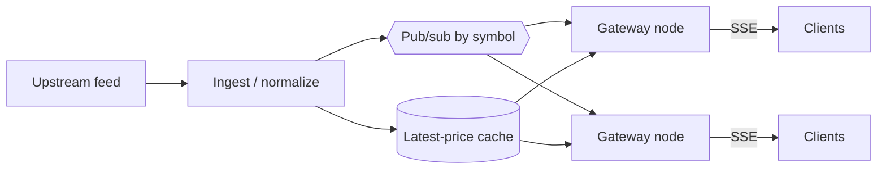

# Design: real-time price delivery

> Compare with `apps/api/src/stockviz/routers/stream.py` and
> [KNOWN_LIMITATIONS.md](../../KNOWN_LIMITATIONS.md).

## 1. Clarify

- How real is "real-time"? Exchange tick data, or ~1 s updates?
- How many concurrent viewers? How many symbols each?
- Does every client need every tick, or the latest value on a cadence?
- Is a missed update acceptable? (For a display: yes. For a fill: no.)

Assume: 100k concurrent viewers, ~1 s updates, latest-value semantics,
dropped intermediate ticks acceptable.

That last assumption is the one to surface early — **a price display needs
the latest value, not every value**, which permits conflation and changes
the design fundamentally.

## 2. Non-functional

| Property | Target |
| --- | --- |
| Latency | < 1 s from upstream tick to browser |
| Concurrency | 100k connections |
| Delivery | Latest-value; drops acceptable |
| Availability | Degrade to polling rather than fail |

## 3. Estimation — the number that decides the design

```
100k viewers × 1 msg/s × ~50 bytes  = 5 MB/s egress   (fine)
100k concurrent connections                            (the real problem)
```

At ~10k connections per node, that's ~10 nodes just holding sockets.
**Connection count, not bandwidth, is the constraint.**

Second critical number: if each server node subscribes to upstream data
independently, you multiply upstream load by the node count. So you need a
**fan-out layer**: one upstream subscription per symbol, fanned out
internally.

## 4. Transport choice

| Option | Fit |
| --- | --- |
| Polling | Simple, cacheable, awful at 1 s × 100k |
| **SSE** | One-way server→client, auto-reconnect, plain HTTP, works through proxies |
| WebSocket | Bidirectional; needed only if clients send data |
| Long polling | Fallback only |

**SSE wins** for price display: the traffic is one-way, `EventSource`
reconnects automatically, and it's ordinary HTTP so proxies and load
balancers handle it without special configuration. WebSocket buys
bidirectionality you don't need and costs you protocol upgrade handling.

## 5. Architecture



- **Gateways are stateless** and hold connections. Scale them for
  connection count.
- **Pub/sub keyed by symbol** so a gateway subscribes only to symbols its
  clients actually watch.
- **Latest-price cache** serves the initial value on connect, so a client
  isn't blank until the next tick.
- **Conflation** at the gateway: if a client is slow, drop intermediate
  ticks and send the newest. Never queue unboundedly per client — that's
  how a slow consumer OOMs a gateway.

## 6. Failure handling

| Failure | Response |
| --- | --- |
| Upstream drops | Serve cache, mark data stale in the UI |
| Gateway dies | `EventSource` reconnects to another node automatically |
| Slow client | Conflate, then disconnect past a threshold |
| Backpressure | Bounded per-connection buffer; drop oldest |

**Never let a slow client apply backpressure to the fan-out.** For
latest-value data the correct response to a slow consumer is to drop
intermediate values, not to buffer.

## 7. What StockViz actually does

StockViz has **no real-time feed.** It stores end-of-day bars, and the
"live" ticker is an explicitly labelled simulation:

```python
# routers/stream.py
price = max(0.01, price * math.exp(random.gauss(0, _VOLATILITY)))
```

A Gaussian random walk seeded from the latest stored close, over SSE, at
3-second ticks.

| Design element | StockViz | Note |
| --- | --- | --- |
| SSE transport | ✅ | Correct choice, right reasons |
| Stateless endpoint | ✅ | No per-client server state |
| Connection cap | ✅ 15 min | `MAX_STREAM_SECONDS` |
| Rate limited | ✅ 10/min per key | |
| Disconnect detection | ✅ `request.is_disconnected()` | |
| Real upstream feed | ❌ | Simulated — labelled in the UI |
| Fan-out / pub-sub | ❌ | Each connection computes its own walk |
| Latest-price cache | ❌ | Reads one bar at connect |
| Conflation / backpressure | ➖ | Not applicable to a generated stream |

### The interview-worthy detail

```python
"""This endpoint deliberately does *not* take the ``get_session``
dependency: FastAPI holds ``yield`` dependencies open for the lifetime of
the response, so with a long-lived StreamingResponse every connected
client would pin one Postgres connection."""
```

The default pool is 5 + 10 overflow, so **~15 concurrent viewers of a
ticker page would have deadlocked the entire API.** The fix is a plain
function that opens and closes its own session before streaming starts.

This is a genuinely good story: a framework convenience (dependency
injection) whose lifetime semantics are wrong for streaming, discovered by
reasoning about connection lifetime rather than by load testing.

The 15-minute cap is the same class of thinking — a forgotten browser tab
otherwise holds a worker slot forever.

## Follow-ups

**"Why SSE and not WebSocket?"**
> The traffic is one-way. SSE gives automatic reconnection, works over
> plain HTTP through proxies, and needs no upgrade handling. WebSocket
> would add bidirectionality I don't use.

**"100k concurrent SSE connections — where does it break first?"**
> File descriptors and memory per connection on the gateway, long before
> bandwidth. I'd scale gateways horizontally and make sure each subscribes
> upstream once per symbol rather than once per client — otherwise
> upstream load multiplies by node count.

**"A client can't keep up."**
> For latest-value data, conflate: drop intermediate ticks and send the
> newest. Bounded buffer, drop oldest, disconnect past a threshold. Never
> let one slow client apply backpressure to the fan-out.

**"Your stream pins no database connection. Explain."**
> FastAPI holds `yield` dependencies open for the whole response, so a
> `get_session` dependency on a long-lived stream pins a pooled connection
> per viewer. With a 15-connection pool, about fifteen viewers would have
> deadlocked the API. The endpoint reads its initial close in an explicit
> `with Session(...)` block that closes before streaming starts.

**"How would you make this real?"**
> Licensed feed, a normalize/ingest tier, symbol-keyed pub/sub, stateless
> SSE gateways, and a latest-price cache for connect. The endpoint shape
> barely changes — what changes is everything behind it. And I'd stop
> calling it "live" until the feed is real, which is why it's labelled a
> simulation today.
