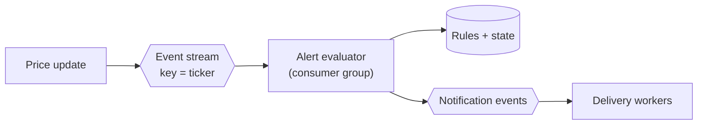

# Design: a stock-alert platform

> Compare with `services/alerts.py`, `events/handlers.py::apply_market_bars_refreshed`,
> and [OPERATIONAL_TRADING.md](../../OPERATIONAL_TRADING.md).

## 1. Clarify

- What can users alert on? Price thresholds, % moves, indicators, news?
- How fast must an alert fire — same second, or same session?
- Delivery: in-app, email, push?
- **Exactly once, or at-least-once?** (Duplicate alerts are a real product
  problem.)
- Does an alert re-arm after firing, or fire once?

Assume: price thresholds, 1M users × ~5 alerts = 5M rules, fire within
seconds of a price change, at-most-once delivery preferred, one-shot
alerts.

## 2. Non-functional

| Property | Target |
| --- | --- |
| Rule count | 5M active |
| Latency | Seconds after a qualifying price change |
| Duplicates | Strongly undesirable — users notice |
| Missed alerts | Worse than late alerts |

## 3. The core insight

The naive design — scan all 5M rules on every price update — is wrong by
orders of magnitude. Two structural facts fix it:

1. **A price change for symbol X can only trigger rules on symbol X.**
   Index rules by ticker; a tick touches only that ticker's rules.
2. **Rules are ordered thresholds.** For a given ticker, keep two sorted
   structures — "above" and "below". A move from $100 to $105 triggers
   exactly the "above" rules in `(100, 105]`, found by range scan.

```
5M rules / 8,000 symbols ≈ 600 rules per symbol
A tick evaluates a range slice of ~600, not 5M.
```

That reduction is the answer to this question, and stating it early is
what distinguishes a strong response.

## 4. Data model

```sql
alerts (
  id, user_id, ticker, direction, threshold,
  status,             -- ACTIVE | TRIGGERED | DISMISSED
  triggered_at
)
INDEX (ticker, status, threshold)   -- the range-scan index
INDEX (user_id, status)             -- "my alerts"
```

The first index is the load-bearing one: equality on `ticker` and
`status`, then an ordered range on `threshold` — the same
equality-then-range shape as
[`price_bars`](../databases/indexes-and-keys.md).

## 5. Architecture



Keying the stream by `ticker` gives two things at once: per-symbol
ordering (so a rule can't be evaluated against an older price after a
newer one) and natural sharding of evaluation work.

## 6. Exactly-once delivery

You cannot get exactly-once end-to-end. What you can do is make the
**state transition** atomic and idempotent:

```sql
UPDATE alerts SET status = 'TRIGGERED', triggered_at = now()
 WHERE id = :id AND status = 'ACTIVE'
```

The `AND status = 'ACTIVE'` is a compare-and-set. If zero rows are
updated, another worker already fired it — so **only the worker that won
the update emits the notification.** A duplicate event replays the query,
matches nothing, and sends nothing.

That is the whole trick, and it's the same principle as the
[consumer inbox](../kafka/outbox-and-delivery.md#the-inbox-half): let a
database write arbitrate, and make the side effect conditional on winning
it.

## 7. What StockViz actually does

| Design element | StockViz | Where |
| --- | --- | --- |
| Rules indexed by ticker | ✅ | `models/alert.py` |
| Evaluated per-ticker on new bars | ✅ | `apply_market_bars_refreshed` |
| Event-driven, not polling | ✅ | Analytics consumer on `market.bars.refreshed` |
| Idempotent evaluation | ✅ Consumer inbox + same transaction | `events/handlers.py` |
| Ownership-scoped reads | ✅ | `routers/alerts.py` |
| One-shot (no re-arm) | ✅ `triggered_at` | |
| Threshold range scan | ❌ Evaluates the ticker's alerts directly | Fine at current scale |
| Delivery beyond in-app | ❌ | [KNOWN_LIMITATIONS](../../KNOWN_LIMITATIONS.md) |
| Sub-second latency | ❌ Daily bars only | |

The architecture is right; the scale is small. `evaluate_pending_alerts`
is called with `commit=False` from the consumer handler, so **alert state
and the inbox receipt commit in one transaction** — which is exactly the
atomicity the exactly-once discussion above requires.

**Honest framing:** "alerts fire when a bar refreshes, which is end-of-day
plus hourly for top movers. The evaluation is event-driven and idempotent;
the *cadence* is limited by the data, not the design."

## Follow-ups

**"5M rules, a tick arrives. How many do you evaluate?"**
> Only that ticker's — about 600 on average. And within those, a range
> scan on threshold between the old and new price, so typically a handful.
> Never a full scan.

**"Two workers process the same price event. Does the user get two alerts?"**
> No. Firing is a conditional update — `SET status='TRIGGERED' WHERE
> status='ACTIVE'` — and only the worker whose update affects a row emits
> the notification. The loser sees zero rows and sends nothing.

**"A user has 10,000 alerts on one ticker."**
> The range scan still bounds work to the alerts actually crossed. I'd add
> a per-user rule cap regardless — StockViz already caps active alerts per
> user in `routers/alerts.py`.

**"How do you avoid alert storms on a volatile day?"**
> Alerts are one-shot: `triggered_at` is set and the rule leaves the
> active set, so it can't re-fire. If alerts re-armed I'd need hysteresis
> — a band the price must exit before the rule becomes eligible again.

**"Why not a cron job that scans everything?"**
> At 5M rules and second-level latency, a full scan can't keep up and does
> constant work regardless of whether anything changed. Event-driven work
> is proportional to actual price changes. StockViz still runs a scheduled
> full-universe metrics job — but deliberately, as *reconciliation* to
> repair drift, not as the primary path.
