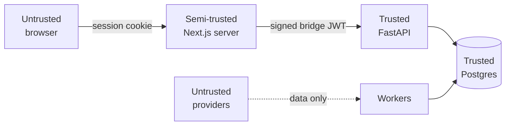

# Threat model

Scope: StockViz as deployed — Next.js on Vercel, FastAPI + Postgres on
Render, optional Kafka workers, and a kind lab. **Paper trading only: no
real money, no real brokerage connectivity, no PII beyond email and
name.** That materially lowers the stakes and is worth stating before any
threat list.

## Assets

| Asset | Sensitivity | Why |
| --- | --- | --- |
| `INTERNAL_API_TOKEN` | **Critical** | Signs the bridge JWT; forging one impersonates any user |
| `AUTH_SECRET` | **Critical** | Forges browser sessions |
| `password_hash` | High | bcrypt, but reused passwords are a real-world risk |
| User email | Moderate | Only PII stored |
| Portfolio / trades | Moderate | Simulated, but private to the user |
| Provider API keys | Moderate | Financial cost and quota exhaustion if abused |
| Market data | Low | Public information |

## Trust boundaries

The providers boundary is the one people forget: yfinance, Newsdata, and
Alpha Vantage responses are **untrusted input**, parsed into the database.

## Threats and controls

### T1 — Forge a bridge token to act as another user
**Impact:** Critical. **Likelihood:** Low.
Controls: HS256 signature over `sub`; `algorithms=["HS256"]` pinned
(blocks `alg: none`); 60 s expiry; secret never sent to the browser
(`import "server-only"`); both apps refuse dev defaults in production.
Tested in `tests/test_auth_bridge.py`.
**Residual:** anyone who obtains `INTERNAL_API_TOKEN` has full
impersonation. There is no rotation procedure and no token revocation.

### T2 — IDOR: read or mutate another user's data
**Impact:** High. **Likelihood:** Low.
Controls: every authenticated route scopes by the verified `sub`; **no
endpoint accepts a `user_id` parameter**; ownership mismatches return 404
rather than 403.
**Residual:** the pattern is a convention, not enforced by types. A new
router that forgets the check would not fail any existing test.

### T3 — Credential stuffing / brute force
**Impact:** Moderate. **Likelihood:** Moderate.
Controls: bcrypt comparison; Zod length limits; identical response for
unknown user and wrong password.
**Residual:** **no account lockout, no per-account rate limit, no CAPTCHA.**
The credentials endpoint is a Next.js route, so slowapi does not apply.
This is the most actionable gap in this document.

### T4 — Denial of service
**Impact:** Moderate. **Likelihood:** Moderate.
Controls: slowapi on public reads (60/min; 30 screener, 20 backtest,
10 SSE); SSE capped at 15 minutes per connection and deliberately **not**
holding a `get_session` dependency — otherwise ~15 concurrent viewers
would exhaust the connection pool.
**Residual:** limits are per-process, so 5 replicas means up to 5× the
budget ([ADR-0004](../adr/ADR-0004-no-redis.md)). Connection-pool
arithmetic is a real ceiling
([runbook](../operations/runbooks/postgres-connections.md)).

### T5 — SQL injection
**Impact:** Critical. **Likelihood:** Very low.
Controls: SQLModel/SQLAlchemy parameter binding throughout. Raw SQL is
confined to `text("SELECT 1")` (health), advisory-lock calls with bound
parameters, and `pg_scratch.py` (tests). The one f-string into SQL —
`DROP DATABASE "{dbname}"` — is a test helper with hardcoded constants.

### T6 — XSS via user-generated content
**Impact:** Moderate. **Likelihood:** Low.
Controls: React escapes by default; comments are stored and rendered as
text.
**Residual:** no Content-Security-Policy header is configured. News
`title`/`summary`/`image_url` come from a third party and are rendered —
React escaping is doing the work there.

### T7 — Malicious or malformed provider data
**Impact:** Moderate. **Likelihood:** Low.
Controls: Pydantic/dataclass shaping into `BarRecord`; `Numeric(18,6)`
columns reject non-numerics; `(ticker, ts, interval)` upsert bounds the
blast radius to overwriting a bar.
**Residual:** **no sanity bounds on prices.** A provider returning a
negative or absurd close would be stored and would flow into fills,
alerts, and NAV. There is no plausibility check.

### T8 — Supply chain
**Impact:** High. **Likelihood:** Low.
Controls: `pnpm-lock.yaml` and `uv.lock` committed; `uv lock --check` in
CI; `pnpm audit --audit-level high --prod` and `pip-audit` on the exact
locked set.
**Note:** `PYSEC-2026-1325` (ecdsa, Minerva timing) is explicitly ignored
with a documented reason — it reaches the project only through
python-jose's ES* algorithms, which the HS256 bridge never uses. That is
the right way to suppress an advisory: narrowly, with the reasoning
recorded.

### T9 — Container escape / lateral movement
**Impact:** High. **Likelihood:** Very low.
Controls: `runAsNonRoot`, uid 10001, `allowPrivilegeEscalation: false`,
all capabilities dropped, `seccompProfile: RuntimeDefault`, and
`automountServiceAccountToken: false` (no pod talks to the Kubernetes
API).
**Residual:** **no NetworkPolicies** — any pod can reach Postgres and
Kafka directly.

### T10 — Secret exposure in logs or errors
**Impact:** High. **Likelihood:** Low.
Controls: Sentry runs with `send_default_pii=False`; `pg_scratch.py`
handles SQLAlchemy's `***` password masking explicitly; tokens are not
logged (the event pipeline logs `event_id`, topic, and key).
**Residual:** no automated secret scanning in CI.

## Priorities if this became a real service

1. **Account lockout / login throttling** (T3) — the clearest gap, and the
   one an attacker would reach first.
2. **Shared-store rate limiting** (T4) — makes every other limit real.
3. **Secret manager + a documented rotation procedure** (T1) — today
   rotation means downtime.
4. **NetworkPolicies** (T9).
5. **Content-Security-Policy** (T6).
6. **Plausibility bounds on ingested prices** (T7) — cheap, and this is a
   financial system.

Deliberately *not* on this list: WAF, DDoS protection, and pen testing —
appropriate for a real service, but not meaningful for a paper-trading
portfolio project, and claiming them would be dishonest.
